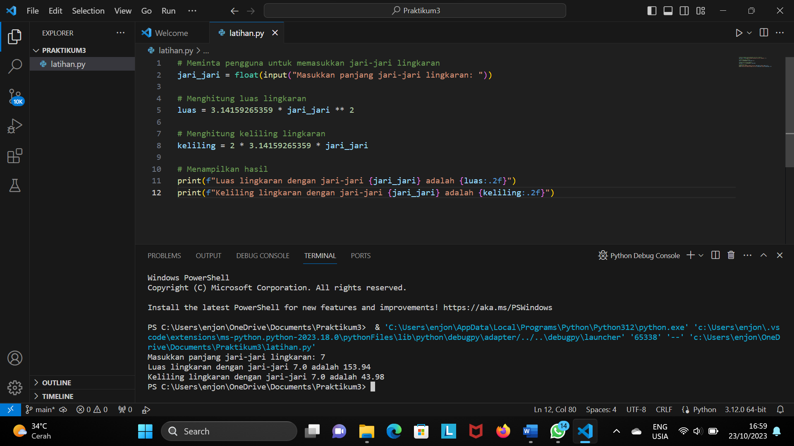

# Praktikum3
<h1>buat repisitory praktikum</h1>

buat kode program untuk menghitung luas dan keliling lingkaran python di visual code

buat flowchart dan menjelaskan program dan keliling lingkaran 

lalu screenshots hasil ekskusi program dan flowchart

simpan project ke repository praktikum 3

